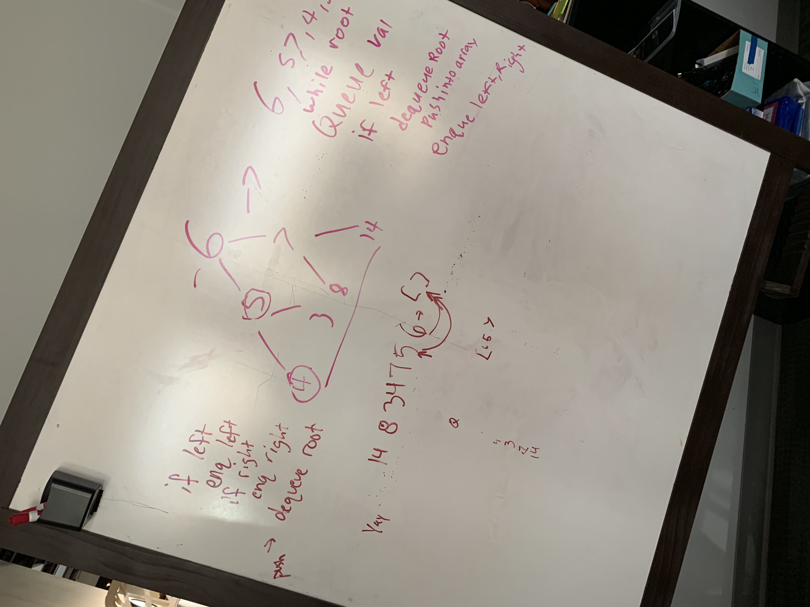

# Code Challenge 16

## FizzBuzz Trees

### Jon Struve

### Links and Resources
* [submission PR](https://github.com/OCDAmmo3/data-structures-and-algorithms/pull/26)
* [travis](https://travis-ci.com/OCDAmmo3/data-structures-and-algorithms/builds/131016212)

### White Board
